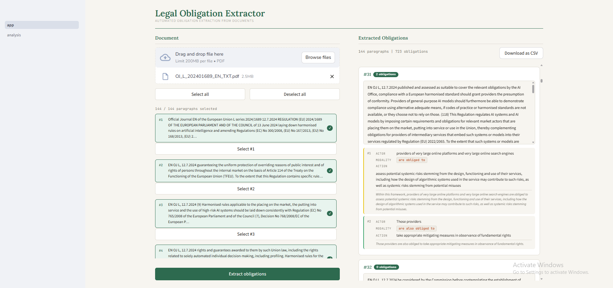
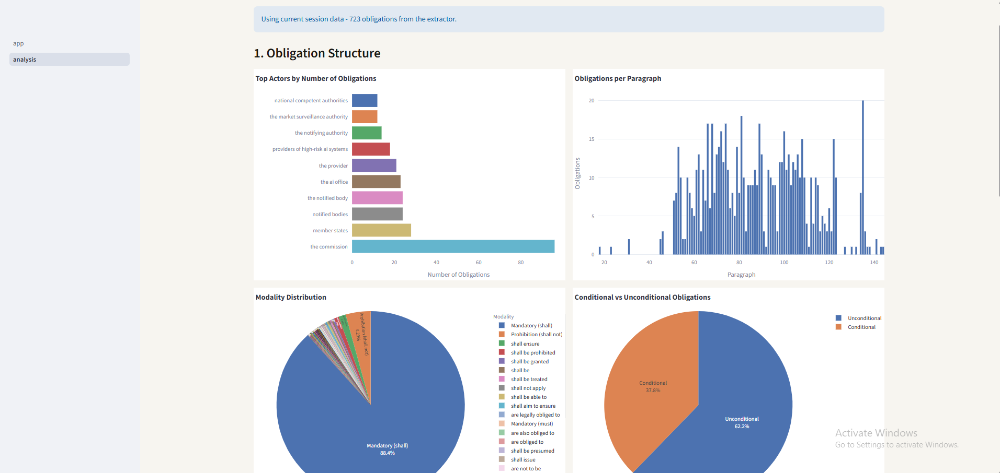
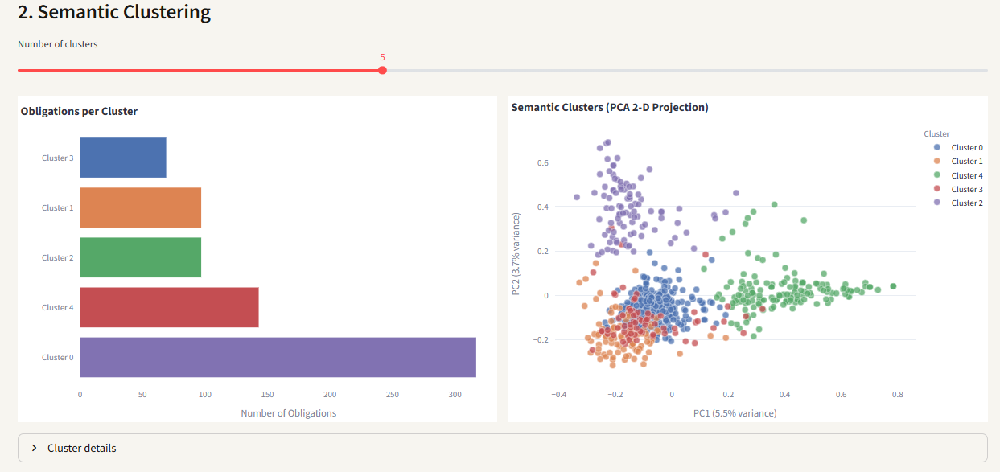

# Legal Obligation Extraction - Project Report
**Rasa Kundrotaite | AI and Data Analytics | 2026**

## Overview

This project automates the extraction of binding legal obligations from regulatory documents. Manually identifying obligations in lengthy legal texts is error-prone and time-consuming. The system replaces that manual effort by combining LLM-based extraction with structured validation and interactive visual analytics, enabling rapid downstream analysis of regulatory content.

## System Design

The application is a two-page Streamlit web app backed by a Python pipeline:

**Extraction page**  
The user uploads a PDF document, which is parsed with `pdfplumber` and split into paragraph-level chunks. Each selected chunk is sent to a large language model (via the Hugging Face Inference API, model `openai/gpt-oss-120b`) with a system prompt that restricts extraction to strictly binding obligations - those expressed with strong deontic modals such as *shall*, *must*, or *shall not* - and explicitly excludes aspirational goals, definitions, and recitals. The model returns a structured JSON response that is validated against a Pydantic schema (`Obligation`: actor, action, modality, condition, span, rationale).

**Analysis page**  
Once obligations are extracted (or a CSV is uploaded), the analysis page provides four interactive Plotly visualisations:
1. **Top actors** - horizontal bar chart of the entities bearing the most obligations
2. **Obligations per paragraph** - distribution across the document
3. **Modality distribution** - pie chart grouping obligations by their deontic type (mandatory, prohibition, directive)
4. **Conditional vs unconditional** - proportion of obligations with a triggering condition

Beyond structure, the page performs **semantic clustering**: obligation texts are vectorised with TF-IDF and grouped using K-Means (user-selectable *k* from 2-10), with a 2-D PCA scatter plot revealing thematic groupings. An interactive **actor -> action network graph** (NetworkX + Plotly) visualises relationships between the top 20 actors and their required actions, with edges coloured by modality.

Extracted obligations can be downloaded as a CSV for further processing.

## Key Technical Choices
| Decision | Rationale |
|-|-|
| Paragraph-level chunking | Preserves sentence boundaries needed for accurate span extraction |
| Pydantic validation | Ensures every model response conforms to the schema before storage |
| TF-IDF + K-Means clustering | Lightweight, interpretable, no embeddings API required |
| Disk-cached extraction | Avoids re-querying the LLM on page refresh |

## Conclusion
The project demonstrates that LLM-based obligation extraction, when combined with schema enforcement and interactive analytics, can significantly accelerate legal text analysis. Future work could extend the extraction prompt to capture cross-references and article citations, and replace TF-IDF clustering with sentence-transformer embeddings for richer semantic grouping.

*© Rasa Kundrotaite, 2026*
